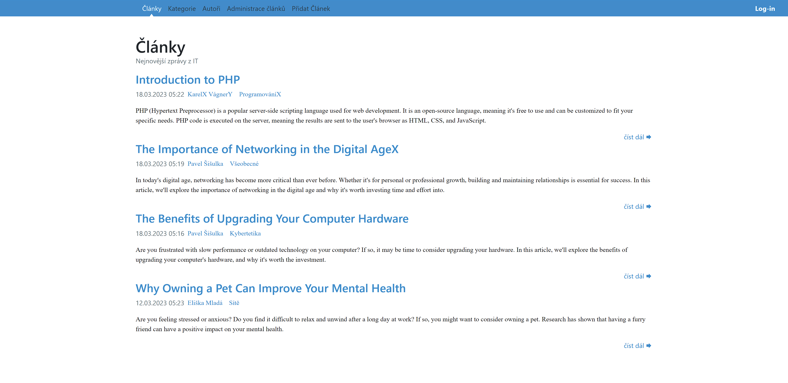
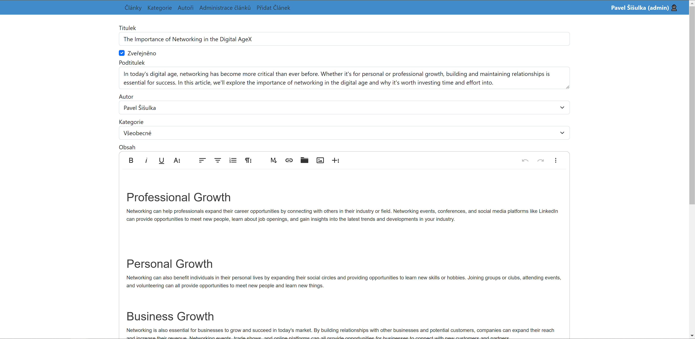
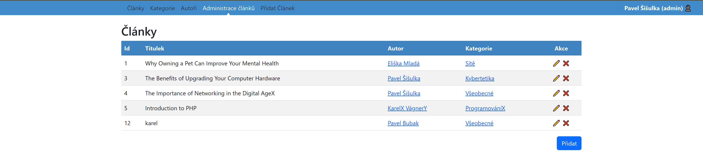
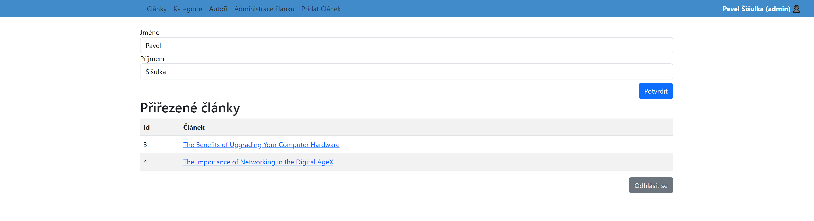

# PHPNews2

A simple website for the latest news about technology. It was made at school to practice PHP OOP   

You can view articles and as a editor/admin you have the priviledges to add, modify and delete them.

    
    
    
    

